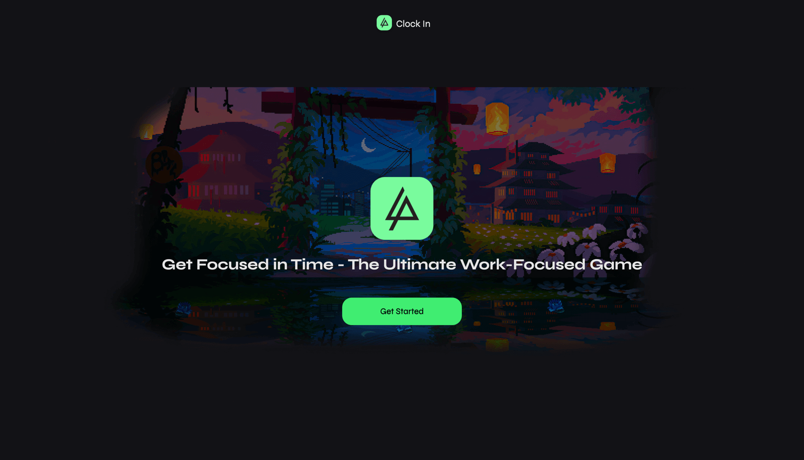
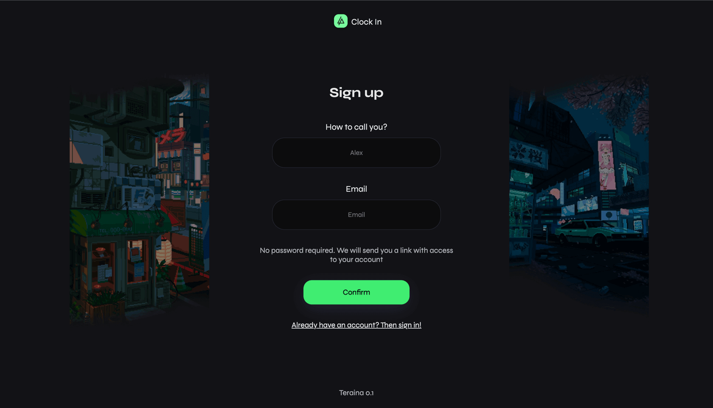
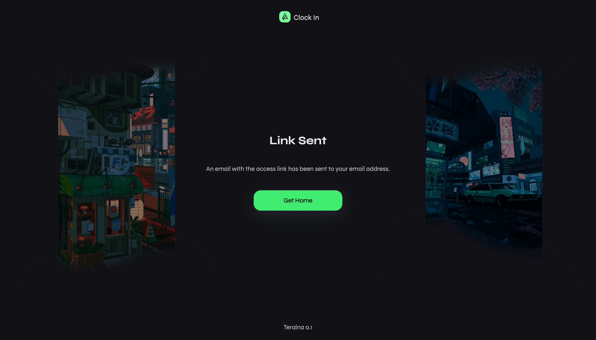
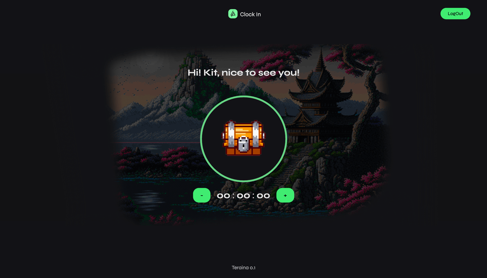
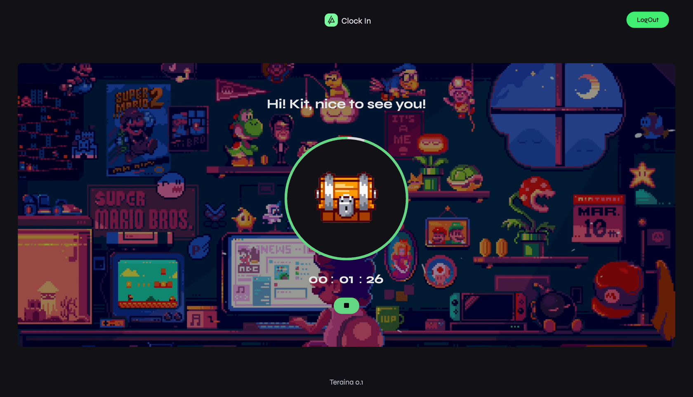
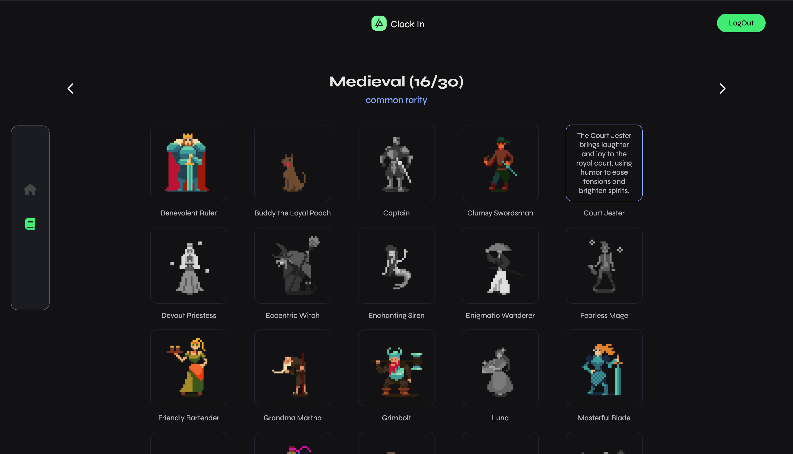
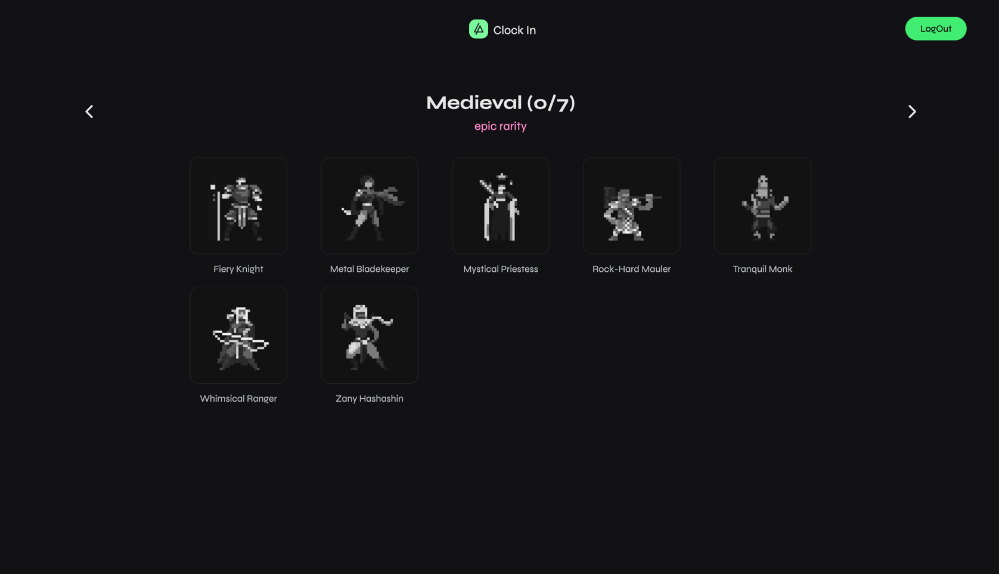
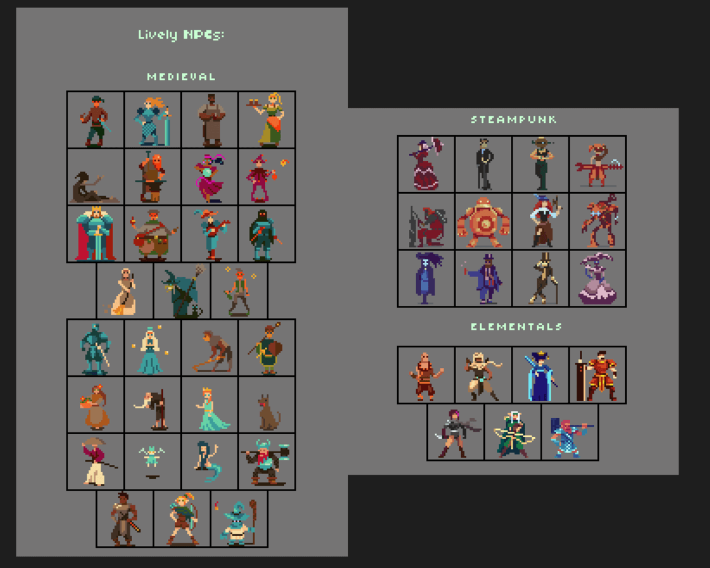

# ClockIn [Front-end]

The idea of the project is to launch an online advertising platform that brings people together to buy, sell or exchange
goods and services.

### Technologies

- React.js
- Vite
- TypeScript
- Redux
- Classnames/FontAwesome/Animate.css
- React Router
- React Countdown-Circle-Timer (Library to implement Timer)
- AWS S3 Bucket is used to store all content

### How to run

To get started you need to have the Back-end part installed on your machine. To know how to run it you can visit the following link (https://github.com/JessieCasey/clockIn-spring-backend)

Then you can open the `Front-end` part in your favorite IDE and type in the terminal the following command `npm install` & `npm run dev`.

### Congratulations! 
You've done everything correct 🎉

### 🌿 Start

Let's try to use it with our hands. Open your browser and type the following:

http://localhost:5173/greeting

### ⚙️ Sign-in/Sign-up

After you hit the button it will redirect you to the application. You'll be asked to sign in (or to sign-up). Note, that this application is not using password authentication, this one implements `MagicLink` authorization method.

http://localhost:5173/authorization/sign-up

### 🏠 Home page
You'll get on email a link with next params:
http://localhost:5173/authorization/confirm?email=ken@gmail.com&token=vz78rzrbm3ndJLU5Vhs1GRVobbt80YlzeYUQpaJwN44

When you set the time, you can run a timer, note, to get better rariry card you need to `work)` more time.

### 📔 Cards page

Each character has its own description and rarity (common, rare and epic). Also on hover you can find a well looking rainbow glowing

### Extra

Here's the list of all characters. Names and description were developed by AI
